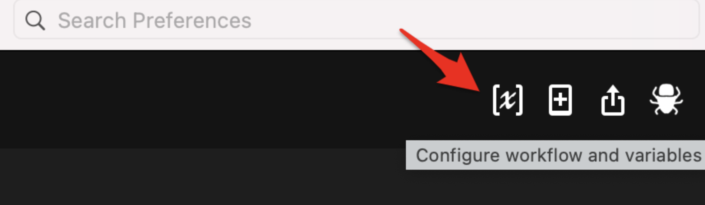

# beeAlfred 

### Mind the [🐝](https://www.beeminder.com/) with [Alfred](https://www.alfredapp.com/)!

A workflow to manage and update your Beeminder goals with Alfred. 

<!-- MarkdownTOC autolink="true" bracket="round" depth="3" autoanchor="true" -->

- [Setting up](#setting-up)
- [Usage](#usage)
- [Known Issues](#known-issues)
- [Acknowledgments](#acknowledgments)
- [Changelog](#changelog)
- [Feedback](#feedback)

<!-- /MarkdownTOC -->

# Setting up beeAlfred

1. Download beeAlfred from Github and double-click to install
2. Get your Beeminder Auth Token 
	- in [Beeminder](https://www.beeminder.com/settings/account#account-permissions), Account Settings > Apps & API > Copy the Auth Token (for the Beeminder API)

3. Set the `BEETOKEN` variable
	- In Alfred, open the 'Configure Workflow and Variables' window in beeAlfred preferences
		
	- set the `BEETOKEN` variable to the Beeminder Auth Token retrieved in Step 2
4. Set the `BEEUSER` variable
	- In Alfred, open the 'Configure Workflow and Variables' window in beeAlfred preferences
	
	- set the `BEEUSER` value to your Beeminder username
5. _Optional:_ Setup a hotkey to launch beeAlfred
6. _Optional:_ Change the keyword to launch beeAlfred
	- keyword currently set to `!q`
7. _Optional:_ Change the comment string (currently: `-- from Alfred 🐝`)
	- In Alfred, open the 'Configure Workflow and Variables' window in beeAlfred preferences
	- Edit the `BEECOMMENT` variable

# Basic Usage 

## Checking the status of your goals
- launch beeAlfred by typing `!q` or using an optional hotkey
- beeAlfred will return goals and their status/deadline

### Entering a new datapoint
- search a goal by typing `!q` followed by a goal name or matching string
- select your goal by pressing `return`. 
	- `option-return (⌥⏎)` will open the goal in Beeminder
- enter your value plus an optional comment after space

# Known issues 

- beeAlfred is using the local timezone to compute derail time. It might not correspond to the real derail time if a different timezone is set on [beeminder.com](beeminder.com)
- nothing else for now, but I have only tested a few use cases, let me know if you see anything!

# Acknowledgments

- [Dean Jackson](https://github.com/deanishe) and [Vitor Galvāo](https://github.com/vitorgalvao) for their incredible help on the Alfred mailing list and for creating many scripts used as templates for this workflow. 

# Changelog

- 05-17-2021: version 1.0
- 05-18-2021: version 1.0.1 (minor fixes)

# Feedback

Feedback welcome! If you notice a bug, or have ideas for new features, please feel free to get in touch either here, or on the [Beeminder](https://forum.beeminder.com/)/[Alfred](https://www.alfredforum.com) forums. 

